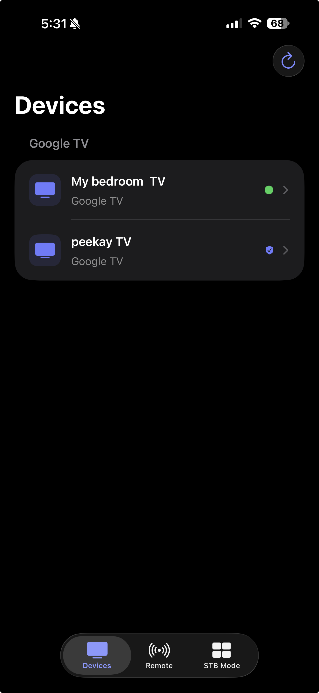
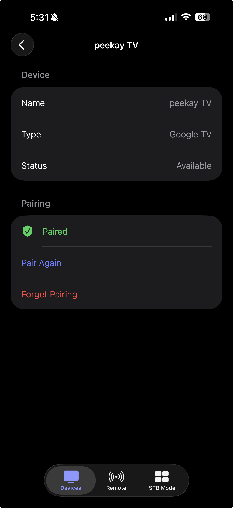
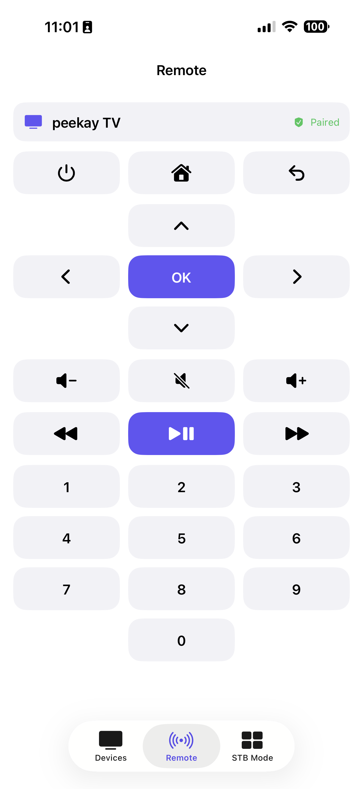
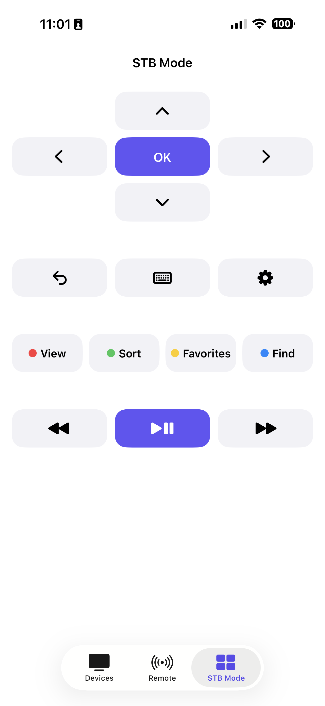

# PK Remote

PK Remote is an open-source Google TV and Android TV remote for iPhone, built with SwiftUI. The MVP discovers TVs on the local network, pairs securely using the code shown on the TV, and provides responsive remote, keyboard, media, and STB portal controls.

## Current Features

- Devices, Remote, and STB Mode navigation
- Google TV and Android TV discovery with Bonjour (mDNS)
- Device searching, empty, error, refresh, and selection states
- Secure Google TV pairing with a six-character on-screen code
- Per-installation RSA client identity stored in the device-only Keychain
- Paired TV certificate fingerprint stored for future connection verification
- Persistent per-device pairing state across app launches
- Authenticated Google TV Remote Protocol command connection
- Directional pad with select, home, back, and power controls
- Volume, mute, number-pad, and media controls
- Keyboard text entry for focused TV fields
- Compact, non-scrolling STB Mode with Home, Back, Keyboard, Settings, color keys, and media controls
- Correct Android TV programmable color-key mappings for STB portals
- Configurable STB app shortcuts in a persistent 4 × 2 grid with an eight-shortcut limit
- Duplicate-free Popular Apps picker backed by a physically verified Remote v2 catalog
- Built-in shortcuts for YouTube, Netflix, Prime Video, Hulu, Peacock, Pluto TV, Apple TV, Disney+, Aha, Max, Tubi, and Play Store
- Advanced custom shortcut editor for TVs that support additional Remote v2 launch identifiers
- Clear, tab-local command feedback that automatically dismisses after a few seconds
- Native Google TV quick-settings panel from the Remote settings button
- Accessibility labels and SwiftUI previews
- Native light and dark appearance support
- Apple `swift-certificates` for X.509 certificate generation

## Screenshots

<table>
  <tr>
    <th>Devices</th>
    <th>Pairing</th>
  </tr>
  <tr>
    <td></td>
    <td></td>
  </tr>
  <tr>
    <th>Remote</th>
    <th>STB Mode</th>
  </tr>
  <tr>
    <td></td>
    <td></td>
  </tr>
</table>

## Roadmap

- [x] Static remote interface
- [x] Reusable remote-control components
- [x] Accessible light and dark UI
- [x] Google TV and Android TV discovery with Bonjour (mDNS)
- [x] Secure pairing with an on-screen pairing code
- [x] Google TV Remote Protocol integration
- [x] Remote command transmission
- [x] Keyboard input
- [x] STB portal color-key controls
- [x] Configurable Remote v2 app shortcuts
- [x] Native Google TV quick-settings access
- [ ] Voice search
- [ ] Expanded real-device compatibility testing
- [ ] Automated UI tests
- [ ] App Store metadata, screenshots, and privacy details
- [ ] App Store release

## Tech Stack

- Swift
- SwiftUI
- Xcode
- Swift Concurrency
- Network framework
- Bonjour / mDNS
- Google TV pairing and remote protocols
- Security and Keychain services
- Apple `swift-certificates`

## Project Structure

```text
PK-Remote/
├── ios/
│   ├── Configuration/       iOS configuration files
│   ├── PK Remote/           SwiftUI app source and assets
│   ├── PK Remote.xcodeproj/ Xcode project
│   └── PK RemoteTests/      Unit tests
├── docs/                    Screenshots and documentation
├── README.md
└── LICENSE
```

## Getting Started

1. Clone the repository:

   ```bash
   git clone https://github.com/praveenkonakanchi/PK-Remote.git
   ```

2. Open `ios/PK Remote.xcodeproj` in Xcode.
3. Select the **PK Remote** target, open **Signing & Capabilities**, and choose your development team.
4. Connect an iPhone, enable Developer Mode if prompted, and select it as the run destination.
5. Build and run the `PK Remote` scheme.
6. Keep the iPhone and TV on the same local network, select the discovered TV, and enter the six-character code shown on the TV.

In **STB Mode**, tap the plus button to choose from apps verified to launch through Google TV Remote v2. Apps already present in the grid are removed from the picker automatically. Long-press an existing shortcut to replace, reorder, or remove it. The plus button is hidden after all eight slots are filled. Raw launch identifiers are available only under **Advanced / Custom Shortcut**.

If a shortcut cannot be opened, STB Mode shows a temporary message beneath the shortcut grid suggesting that the app may need to be installed. Command feedback remains on the screen where it occurred, clears when switching tabs, and automatically dismisses after a few seconds.

The iOS Simulator can be used to review the interface and run tests, but discovery, pairing, and remote commands should be validated on a physical iPhone and compatible TV.

## Installing on a Personal iPhone

- **Free Apple Account:** Xcode can install the app using a Personal Team. The provisioning profile expires after seven days, so the app must be rebuilt and reinstalled periodically.
- **Apple Developer Program:** Use Xcode development or Ad Hoc distribution for registered devices, or upload an archive to TestFlight for beta use.
- **App Store:** For a permanent public installation, create the app record in App Store Connect, archive and upload a release build, complete the required metadata and privacy disclosures, then submit it for App Review.

For everyday use during development, connecting the iPhone to Xcode and pressing Run is the simplest option. Reinstalling the app with the same bundle identifier preserves its app container and Keychain identity in normal update scenarios, so the TV should remain paired.

## MVP Limitations

- Tested primarily against a real Google TV device; behavior may vary across manufacturers and Android TV versions.
- Built-in app shortcuts were physically verified on the development TV, but an app must also be installed on the selected TV and Remote v2 launch support can vary by app version or device.
- Android launcher intents are not universally accepted by Remote v2. Apps that opened a URL chooser or were rejected—including STBEmu, Willow, ZEE5, Paramount+, and Play Movies on the development TV—are intentionally excluded from the built-in catalog.
- Voice input is not implemented.
- The iPhone and TV must be reachable on the same local network.
- This is not yet an App Store release build.

## Contributing

Contributions are welcome. Please open an issue to discuss significant changes, keep pull requests focused, and include relevant build or test results.

When contributing connectivity features, do not commit pairing secrets, certificates, or other credentials.

## License

PK Remote is available under the [MIT License](LICENSE).
