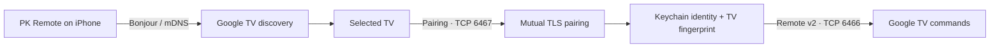
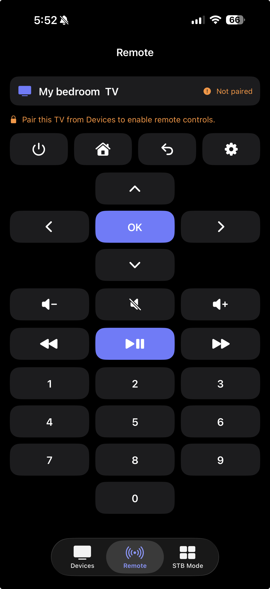
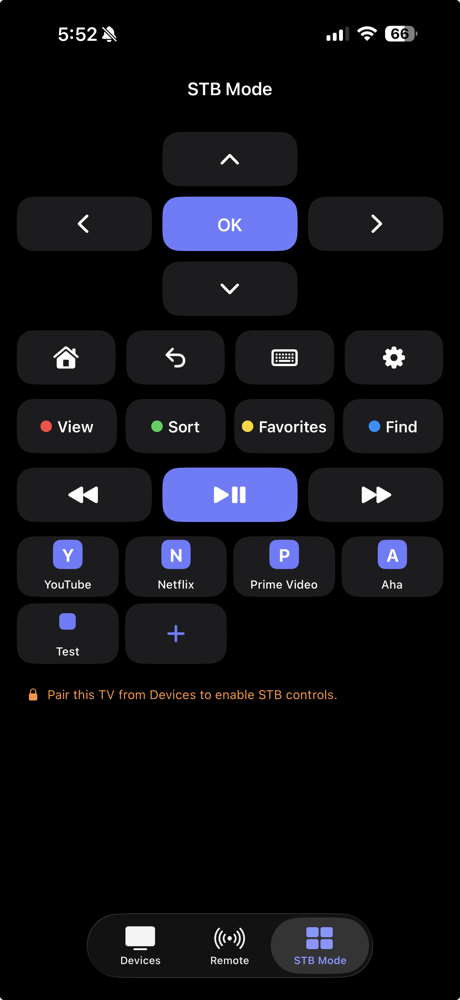
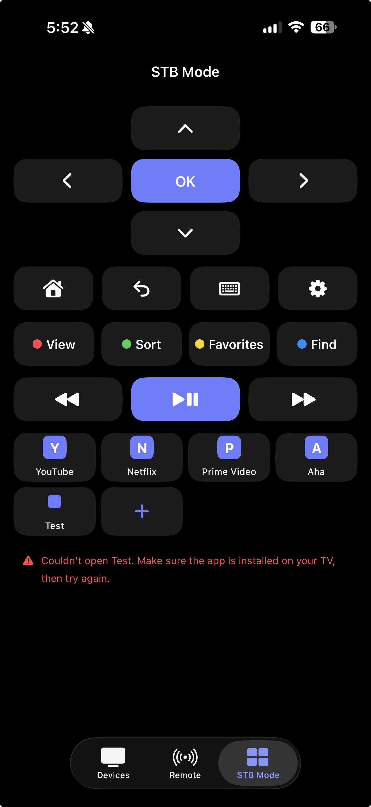

# PK Remote

Swift • SwiftUI • Google TV • Android TV • MIT

PK Remote is an open-source Google TV and Android TV remote. The functional iOS MVP is built with SwiftUI; a native Android phone app is now being developed with Kotlin and Jetpack Compose. The iOS app discovers TVs on the local network, pairs securely using the code shown on the TV, and provides responsive remote, keyboard, media, and STB portal controls.

## Platform Status

- **iOS:** Functional MVP with discovery, secure pairing, authenticated Remote v2 commands, keyboard input, STB controls, and app shortcuts.
- **Android:** Native Kotlin/Jetpack Compose UI foundation under `android/`. Milestone 1 is static and uses harmless local actions only; discovery, pairing, and command transport are not implemented yet.

## Current Features

### Device Discovery

- Google TV and Android TV discovery with Bonjour (mDNS)
- Device searching, empty, error, refresh, and selection states
- Persistent per-device pairing state across app launches

### Secure Pairing

- Secure Google TV pairing with a six-character on-screen code
- Per-installation RSA client identity stored in the device-only Keychain
- Paired TV certificate fingerprint stored for future connection verification
- Pair Again and Forget Pairing recovery actions

### Remote Control

- Authenticated Google TV Remote Protocol command connection
- Directional pad with select, home, back, and power controls
- Volume, mute, number-pad, and media controls
- Keyboard text entry for focused TV fields
- Native Google TV Quick Settings access

### STB Mode

- Compact, non-scrolling STB Mode with Home, Back, Keyboard, Settings, color keys, and media controls
- Correct Android TV programmable color-key mappings for STB portals

### App Shortcuts

- Persistent 4 × 2 shortcut grid with an eight-shortcut limit
- Duplicate-free Popular Apps picker
- Built-in catalog physically verified through Google TV Remote v2
- Automatic shortcut persistence, replacement, removal, and ordering
- Advanced custom shortcut editor for compatible Remote v2 launch identifiers

### UI and Accessibility

- Devices, Remote, and STB Mode navigation
- Accessibility labels and SwiftUI previews
- Native light and dark appearance support
- Clear, tab-local command feedback that automatically dismisses after a few seconds

## Architecture



The app resolves the selected Bonjour service when connecting rather than treating a hostname or IP address as a permanent device identifier. Pairing and remote commands reuse the same per-installation client identity.

## Verified Remote v2 App Shortcuts

The following apps were physically verified to launch through Google TV Remote v2:

- YouTube
- Netflix
- Prime Video
- Apple TV
- Disney+
- Hulu
- Peacock
- Pluto TV
- Aha
- Max
- Tubi
- Play Store

Support for additional apps depends on the app exposing a compatible Google TV Remote v2 launch link.

## Screenshots

<table>
  <tr>
    <th>Devices</th>
    <th>Pairing</th>
  </tr>
  <tr>
    <td></td>
    <td></td>
  </tr>
  <tr>
    <th>Remote</th>
    <th>STB Mode</th>
  </tr>
  <tr>
    <td></td>
    <td></td>
  </tr>
</table>

### Status and error feedback

<table>
  <tr>
    <th>Remote not paired</th>
    <th>STB Mode not paired</th>
    <th>Shortcut unavailable</th>
  </tr>
  <tr>
    <td></td>
    <td></td>
    <td></td>
  </tr>
</table>

## Roadmap

- [x] Static remote interface
- [x] Reusable remote-control components
- [x] Accessible light and dark UI
- [x] Google TV and Android TV discovery with Bonjour (mDNS)
- [x] Secure pairing with an on-screen pairing code
- [x] Google TV Remote Protocol integration
- [x] Remote command transmission
- [x] Keyboard input
- [x] STB portal color-key controls
- [x] Configurable Remote v2 app shortcuts
- [x] Native Google TV quick-settings access
- [ ] Voice search
- [ ] Expanded real-device compatibility testing
- [ ] Automated UI tests
- [x] Android project and Compose UI foundation
- [ ] Android discovery, secure pairing, and Remote v2 transport
- [ ] App Store metadata, screenshots, and privacy details
- [ ] App Store release

## Tech Stack

- Swift
- SwiftUI
- Kotlin
- Jetpack Compose
- Gradle
- Xcode
- Swift Concurrency
- Network framework
- Bonjour / mDNS
- TLS / mutual TLS
- Google TV pairing and remote protocols
- Security and Keychain services
- Apple `swift-certificates`

## Project Structure

```text
PK-Remote/
├── android/                 Native Android phone app
├── ios/
│   ├── Configuration/       iOS configuration files
│   ├── PK Remote/           SwiftUI app source and assets
│   ├── PK Remote.xcodeproj/ Xcode project
│   └── PK RemoteTests/      Unit tests
├── docs/
│   └── screenshots/        App, status, and error screenshots
├── README.md
└── LICENSE
```

## Getting Started

### iOS

1. Clone the repository:

   ```bash
   git clone https://github.com/praveenkonakanchi/PK-Remote.git
   ```

2. Open `ios/PK Remote.xcodeproj` in Xcode.
3. Select the **PK Remote** target, open **Signing & Capabilities**, and choose your development team.
4. Connect an iPhone, enable Developer Mode if prompted, and select it as the run destination.
5. Build and run the `PK Remote` scheme.
6. Keep the iPhone and TV on the same local network, select the discovered TV, and enter the six-character code shown on the TV.

In **STB Mode**, tap the plus button to choose from apps verified to launch through Google TV Remote v2. Apps already present in the grid are removed from the picker automatically. Long-press an existing shortcut to replace, reorder, or remove it. The plus button is hidden after all eight slots are filled. Raw launch identifiers are available only under **Advanced / Custom Shortcut**.

If a shortcut cannot be opened, STB Mode shows a temporary message beneath the shortcut grid suggesting that the app may need to be installed. Command feedback remains on the screen where it occurred, clears when switching tabs, and automatically dismisses after a few seconds.

The iOS Simulator can be used to review the interface and run tests, but discovery, pairing, and remote commands should be validated on a physical iPhone and compatible TV.

### Android UI foundation

Open `android/` in Android Studio, or build from the repository root:

```bash
export JAVA_HOME="/Applications/Android Studio.app/Contents/jbr/Contents/Home"
export ANDROID_HOME="$HOME/Library/Android/sdk"
./android/gradlew -p android :app:assembleDebug
```

See [android/README.md](android/README.md) for the current milestone scope and planned Android architecture. The Android app does not control a TV yet.

## Installing on a Personal iPhone

- **Free Apple Account:** Xcode can install the app using a Personal Team. The provisioning profile expires after seven days, so the app must be rebuilt and reinstalled periodically.
- **Apple Developer Program:** Use Xcode development or Ad Hoc distribution for registered devices, or upload an archive to TestFlight for beta use.
- **App Store:** For a permanent public installation, create the app record in App Store Connect, archive and upload a release build, complete the required metadata and privacy disclosures, then submit it for App Review.

For everyday use during development, connecting the iPhone to Xcode and pressing Run is the simplest option. Reinstalling the app with the same bundle identifier preserves its app container and Keychain identity in normal update scenarios, so the TV should remain paired.

## Physical-device Validation

Validated on a physical Google TV using secure pairing, persistent authentication, remote commands, keyboard input, Quick Settings, and verified Remote v2 app launching.

## MVP Limitations

- Behavior may vary across manufacturers, Android TV versions, and app releases.
- Built-in app shortcuts were physically verified on the development TV, but an app must also be installed on the selected TV and Remote v2 launch support can vary by app version or device.
- Apps that do not expose a compatible Google TV Remote v2 launch link—for example, STBEmu Pro and Willow on the development device—are intentionally excluded from the built-in shortcut catalog.
- ZEE5, Paramount+, and Play Movies opened Android's generic URL chooser on the development device instead of launching directly, so they are also excluded.
- Voice input is not implemented.
- The iPhone and TV must be reachable on the same local network.
- This is not yet an App Store release build.

## Contributing

Contributions are welcome. Please open an issue to discuss significant changes, keep pull requests focused, and include relevant build or test results.

When contributing connectivity features, do not commit pairing secrets, certificates, or other credentials.

## License

PK Remote is available under the [MIT License](LICENSE).
